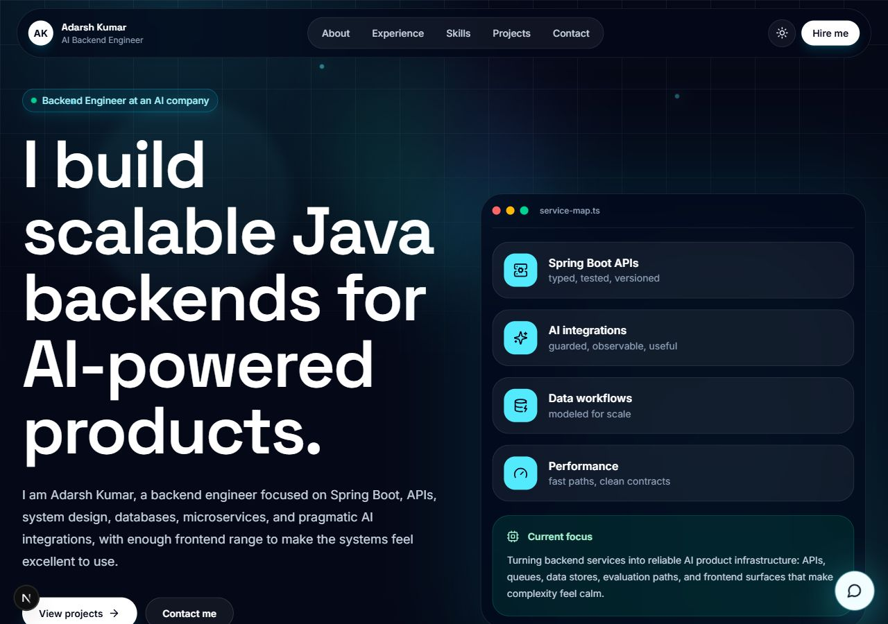

# Next Portfolio

Premium interactive portfolio for Adarsh Kumar, an AI-focused Java Backend Engineer with frontend development skills. The site is built as a modern Next.js product experience with dark/light mode, animated sections, expandable cards, an AI portfolio assistant, and an interactive backend system map.



## Live Demo

Deployment URL will be added here after deployment.

## Highlights

- Modern SaaS/developer portfolio aesthetic with glassmorphism and subtle neomorphic depth.
- Animated hero, scroll reveal sections, magnetic buttons, custom cursor, and ambient background motion.
- Expandable skill cards with animated proficiency indicators.
- Expandable project cards with architecture details.
- Floating AI chatbot assistant for quick recruiter-friendly profile summaries.
- Interactive backend system map that visualizes API, service, AI, data, security, and reliability layers.
- Dark/light theme support without hydration mismatch.
- SEO metadata, accessible buttons, responsive layout, and production build support.

## Tech Stack

- Next.js 16 App Router
- React 19
- TypeScript
- Tailwind CSS 4
- Framer Motion
- Lucide React
- ESLint with Next.js Core Web Vitals config

## Portfolio Context

Adarsh Kumar started as a Backend Engineering Intern at an AI company in January 2025, converted to a full-time Backend Engineer in July 2025, and currently works on scalable backend systems, APIs, Java/Spring Boot services, databases, microservices, and AI integrations.

## Getting Started

Install dependencies:

```bash
npm install
```

Run the development server:

```bash
npm run dev
```

Open [http://localhost:3000](http://localhost:3000) in your browser.

## Scripts

```bash
npm run dev
npm run lint
npm run build
npm run start
```

## Deployment

Recommended free deployment platform: Vercel.

Build command:

```bash
npm run build
```

Install command:

```bash
npm install
```

Output:

Next.js handles the production output automatically.

## Project Structure

```txt
src/
  app/
    globals.css
    layout.tsx
    page.tsx
  components/
    layout/
    sections/
    ui/
  hooks/
  lib/
public/
  screenshot.png
```

## Performance Notes

- Static page rendering through the App Router.
- Client-side animation isolated into focused interaction components.
- Reduced-motion CSS support.
- No script-based theme injection, avoiding hydration drift.
- Optimized fonts through `next/font`.

